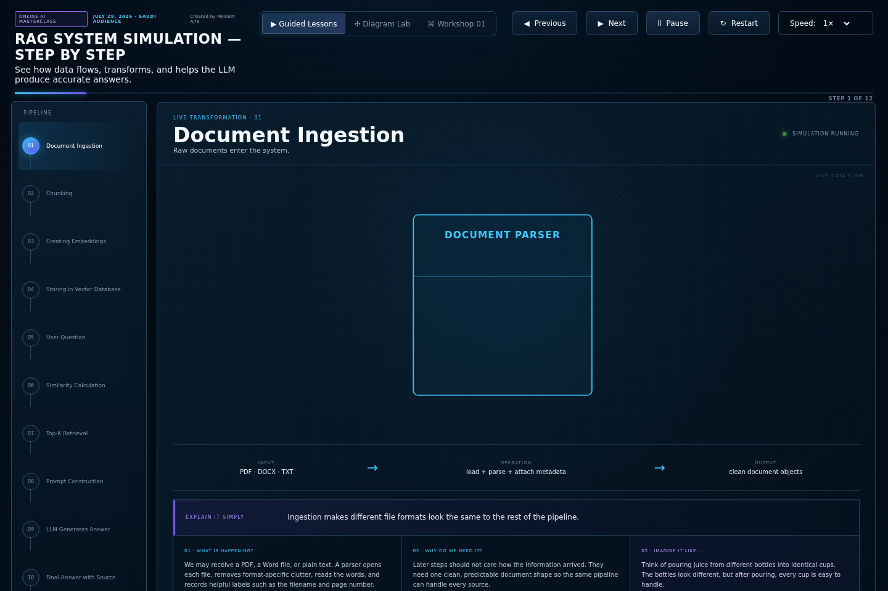
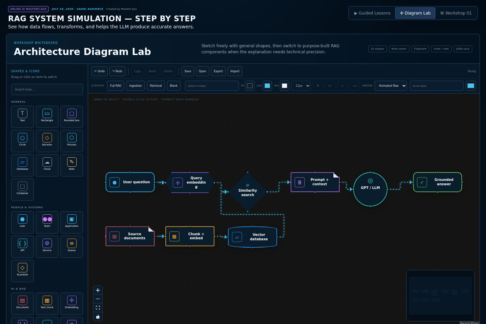
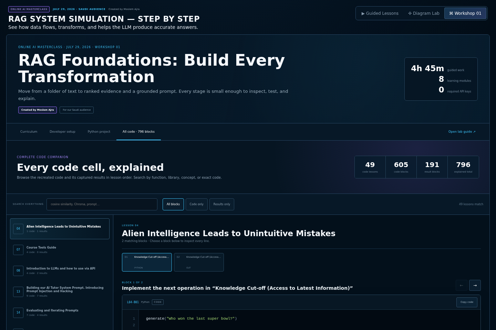
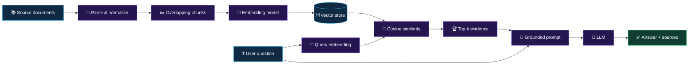
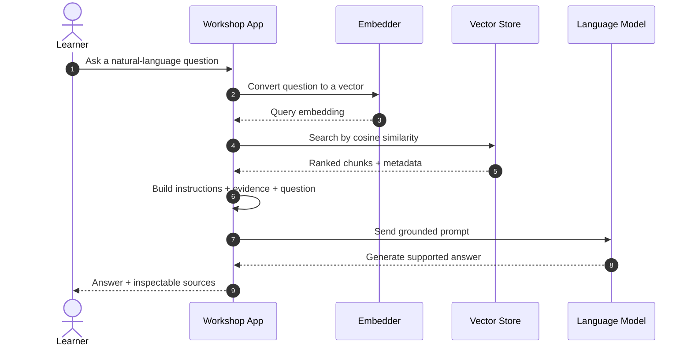
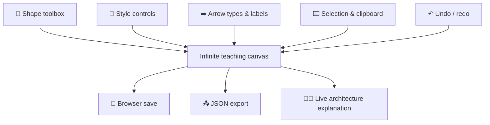

<div align="center">

# 🧠 Online AI Masterclass

### Inside RAG — From Documents to Grounded Answers

An interactive learning experience that makes every important transformation in a
Retrieval-Augmented Generation system visible, inspectable, and explainable.

[](https://github.com/moslemajra85)
[](#-masterclass-details)
[](#-masterclass-details)

[](https://github.com/moslemajra85/online-ai-masterclass-rag/actions/workflows/ci.yml)


[🚀 Live Workshop](https://rag-journey-workshop.ajra-new-era.chatgpt.site) ·
[🧪 Python Lab](workshops/workshop-01-rag-foundations/README.md) ·
[🤝 Contributing](CONTRIBUTING.md) ·
[🔐 Security](SECURITY.md)

</div>

---

> [!NOTE]
> This repository accompanies an instructor-led online AI masterclass created by
> **Moslem Ajra** for a Saudi audience on **July 29, 2026**. The live deployment is
> currently restricted to approved participants.

## 🔗 Project links — what is each one?

| Link | What it opens | Who can access it? |
|---|---|---|
| [🌐 **Live interactive workshop**](https://rag-journey-workshop.ajra-new-era.chatgpt.site) | The running animated application used during the masterclass | Moslem Ajra and approved participants |
| [💻 **Public GitHub repository**](https://github.com/moslemajra85/online-ai-masterclass-rag) | Source code, setup instructions, screenshots, Python lab, and contribution history | Everyone |

The **live workshop** is the application itself. The **GitHub repository** is where
developers can inspect, download, and improve its code. If the live link asks you
to sign in or says access is restricted, that is expected with the current
owner-only deployment.

## ✨ Why this project exists

RAG is often presented as one large box: documents go in and a confident answer
comes out. That hides the engineering decisions that determine whether the answer
is useful, traceable, secure, and correct.

This workshop opens the box.

- 👀 Watch documents become chunks, vectors, ranked evidence, and a final prompt.
- 🧮 Inspect cosine-similarity calculations instead of treating search as magic.
- 🧱 Build architecture diagrams during the explanation.
- 💻 Browse every supplied code cell with syntax highlighting and line-by-line notes.
- 🧪 Run the complete retrieval pipeline locally without a paid API.
- 🔌 Replace the learning embedder with an optional hosted embedding adapter.

## 🗺️ Choose your experience

| Experience | What you do | Best for |
|---|---|---|
| 🎬 **Guided Lessons** | Move through 12 animated RAG transformations | Building a clear mental model |
| 🎨 **Diagram Lab** | Draw architectures with 25 shapes, arrows, colors, history, and clipboard tools | Live teaching and system design |
| 🧭 **Workshop 01** | Follow eight progressive engineering modules | Structured instructor-led learning |
| 💻 **Code Companion** | Search 605 code blocks and 191 captured outputs | Understanding the supplied implementation |
| 🐍 **Python Lab** | Run chunking, embeddings, retrieval, prompting, CLI, notebook, and tests | Hands-on engineering practice |

## 🖼️ Interface preview

### 🎬 Guided RAG lessons

Watch one transformation at a time. The stage, moving data, explanation, controls,
and engineering notes stay together so learners can connect the animation to the
underlying idea.

[](docs/images/guided-lessons.png)

### 🎨 Architecture Diagram Lab

Build and edit a complete RAG architecture during the workshop with reusable
components, labeled connections, style controls, history, clipboard operations,
zoom, minimap, and JSON import/export.

[](docs/images/diagram-lab.png)

### 💻 Complete Code Companion

Search the full workshop archive, inspect syntax-highlighted source and captured
outputs, copy individual blocks, and move from a simple explanation to
production-minded guidance.

[](docs/images/code-companion.png)

> Click any screenshot to open the full-resolution image.

## 🔄 The RAG story



The system has two distinct responsibilities:

1. **Retrieval** chooses evidence from stored knowledge.
2. **Generation** explains that evidence in natural language.

Keeping those responsibilities separate makes weak retrieval, weak prompting, and
unsupported generation easier to identify and improve.

## 🧩 What happens inside one request?



## 🎓 Workshop 01 curriculum

| Module | Topic | Deliverable |
|---:|---|---|
| 01 | 🧠 Build the mental model | A hand-drawn request flow |
| 02 | 🛠️ Prepare the Python workspace | Reproducible `.venv` and notebook kernel |
| 03 | 📄 Load clean documents | Validated documents with source metadata |
| 04 | ✂️ Chunk with overlap | Passages with visible boundaries |
| 05 | 🔢 Create embeddings | One normalized vector per chunk |
| 06 | 📐 Calculate cosine similarity | A sorted score table |
| 07 | 📝 Build a grounded prompt | Instructions, evidence, question, and fallback |
| 08 | 🧪 Evaluate the pipeline | Retrieval and grounded-answer test cases |

Each module presents:

- a child-friendly explanation;
- the deeper engineering model;
- a concrete deliverable;
- clear completion checks;
- risks and production limitations.

## 💻 Complete code companion

The searchable browser recreates the supplied workshop code as a neutral teaching
catalog.

| Catalog metric | Count |
|---|---:|
| Code-bearing lessons | **49** |
| Syntax-highlighted code blocks | **605** |
| Captured result blocks | **191** |
| Total explained blocks | **796** |

Every selected block includes:

- line numbers and syntax highlighting;
- copy-to-clipboard support;
- lesson and section context;
- “explain it simply” guidance;
- engineering-level explanation;
- production warnings;
- concepts and library labels;
- a walkthrough of every non-empty line.

Historical model names and package versions remain visibly marked so archived
examples are not mistaken for current production recommendations.

## 🎨 Diagram Lab capabilities



- Generic shapes: rectangle, rounded box, circle, diamond, hexagon, database,
  cloud, note, text, and container.
- RAG components: documents, chunks, vectors, embedding models, retrievers,
  prompts, LLMs, answers, evaluations, and guardrails.
- Editing: inline text, fill/line/text colors, font size, weight, and alignment.
- Interaction: multi-select, copy/paste, select-all, delete, undo, and redo.
- Connections: animated, curved, straight, dashed, bidirectional, and labeled.
- Persistence: browser save/open plus JSON import/export.

## 🚀 Quick start

### Prerequisites

- Node.js 22+
- npm
- Python 3.11+ for the hands-on lab

### Run the interactive website

```bash
git clone https://github.com/moslemajra85/online-ai-masterclass-rag.git
cd online-ai-masterclass-rag
npm ci
npm run dev
```

Open the local address shown in the terminal.

### Build the production application

```bash
npm run build
```

The vinext build generates a Cloudflare-compatible application under `dist/`.

## 🐍 Run the Python lab

```bash
cd workshops/workshop-01-rag-foundations

python -m venv .venv
source .venv/bin/activate
# Windows PowerShell: .venv\Scripts\Activate.ps1

python -m pip install --upgrade pip
python -m pip install -e ".[dev,notebook]"

rag-lab "How many remote days are allowed?"
python -m pytest -q
jupyter lab notebooks/01_rag_from_scratch.ipynb
```

The default implementation is deterministic and local. It intentionally uses an
inspectable hashing embedder so the workshop is not blocked by an account, network
connection, or paid API. The optional OpenAI adapter demonstrates a replaceable
production-provider boundary.

## 🏗️ Repository architecture

```text
online-ai-masterclass-rag/
├── .github/workflows/ci.yml            # GitHub build and test checks
├── app/
│   ├── page.js                         # Animated RAG learning experience
│   ├── DiagramLab.js                   # Architecture whiteboard
│   ├── WorkshopHub.js                  # Curriculum and developer setup
│   ├── WorkshopCodeExplorer.js         # Highlighted code companion
│   └── globals.css                     # Complete visual system
├── scripts/
│   ├── import-workshop-html.py          # Neutral HTML code importer
│   ├── prepare-workshop-assets.mjs      # Publish downloadable lab files
│   └── prepare-sites-build.mjs          # Package Sites metadata
├── workshops/
│   ├── workshop-01-code-catalog.json    # 796 explained code/output blocks
│   └── workshop-01-rag-foundations/
│       ├── data/knowledge_base.json
│       ├── notebooks/01_rag_from_scratch.ipynb
│       ├── src/rag_workshop/
│       ├── tests/
│       └── pyproject.toml
├── CONTRIBUTING.md
├── SECURITY.md
└── README.md
```

## 🧰 Technology choices

| Area | Technology | Why it exists |
|---|---|---|
| Interface | React 19 | Component-driven interactive teaching UI |
| Build/runtime | vinext + Vite | App Router compatibility and Worker output |
| Animation | GSAP | Sequenced, presenter-friendly transformations |
| Diagramming | React Flow | Nodes, edges, selection, navigation, and minimap |
| Highlighting | Prism | Lightweight multi-language code presentation |
| Lab | Python 3.11+ | Readable implementation of the RAG mechanics |
| Testing | pytest | Fast behavioral checks for retrieval building blocks |
| Hosting | Cloudflare Workers | Production edge deployment |

## ✅ Verification

Run the same core checks used by CI:

```bash
npm ci
npm audit --omit=dev
npm run build

cd workshops/workshop-01-rag-foundations
python -m pip install -e ".[dev]"
python -m pytest -q
```

The GitHub workflow verifies the web build and Python lab independently on pushes
to `main` and on pull requests.

## 🔁 Refresh the supplied code catalog

Production builds use the committed neutral catalog and never depend on a private
mounted directory. When the supplied HTML archive changes:

```bash
python -m pip install -r scripts/requirements-import.txt
python scripts/import-workshop-html.py "/path/to/HTML"
```

The importer:

1. locates code and captured output blocks;
2. preserves lesson and section context;
3. neutralizes source-owner attribution and owner-specific links;
4. generates explanations, concepts, and warnings;
5. writes `workshops/workshop-01-code-catalog.json`.

## 📅 Masterclass details

| | |
|---|---|
| 👤 **Creator and instructor** | [Moslem Ajra](https://github.com/moslemajra85) |
| 🗓️ **Date** | July 29, 2026 |
| 🌐 **Format** | Online, instructor-led |
| 🇸🇦 **Audience** | Saudi Arabia |
| 🎯 **Goal** | Build a practical and inspectable mental model of RAG engineering |

## 🤝 Contributing

Focused improvements are welcome. Please read [CONTRIBUTING.md](CONTRIBUTING.md)
before opening a pull request.

Good contributions include:

- clearer explanations and analogies;
- additional retrieval evaluation cases;
- accessibility and responsive-design improvements;
- diagramming utilities that support live teaching;
- well-tested Python exercises.

## 🔐 Security

Never commit `.env` files, API keys, participant information, or generated virtual
environments. Report suspected vulnerabilities privately as described in
[SECURITY.md](SECURITY.md).

## 📄 License

No reuse license has been selected yet. Until a license is added, the source remains
copyrighted and reuse rights are not automatically granted.

---

<div align="center">

### Built for people who want to understand what happens inside the AI system.

**Created by Moslem Ajra · Online AI Masterclass · July 29, 2026 · Saudi Arabia**

[⬆ Back to top](#-online-ai-masterclass)

</div>
