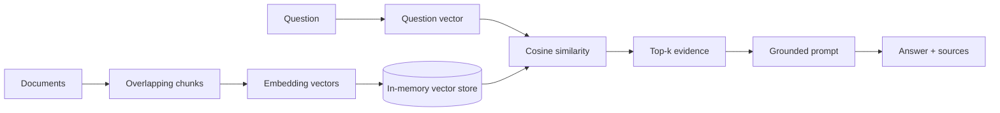

# Workshop 1 — RAG Foundations

Part of the **Online AI Masterclass**, created by **Moslem Ajra** for a Saudi
audience on **July 29, 2026**.

Build a retrieval-augmented generation pipeline whose intermediate data you can
inspect. The default lab runs locally and does not need an API key.

## What you will build

The pipeline loads short documents, splits them into overlapping chunks, creates
deterministic vectors, calculates cosine similarity, retrieves the best evidence,
builds a grounded prompt, and returns an answer with sources.



The arrows show transformations. Documents become chunks, chunks become vectors,
and the question becomes a vector in the same coordinate system. Similarity search
selects evidence; it does not generate the answer.

## Local setup

```bash
cd workshops/workshop-01-rag-foundations
python -m venv .venv
source .venv/bin/activate             # Windows PowerShell: .venv\Scripts\Activate.ps1
python -m pip install --upgrade pip
python -m pip install -e ".[dev,notebook]"
rag-lab "How many remote days are allowed?"
pytest
```

## VS Code + Jupyter

1. Install the Microsoft Python and Jupyter extensions.
2. Open this workshop folder in VS Code.
3. Run `Python: Select Interpreter` and choose `.venv`.
4. Open `notebooks/01_rag_from_scratch.ipynb`.
5. Choose the same `.venv` as the notebook kernel, then run cells from top to bottom.

## Optional OpenAI adapter

The local hashing embedder is intentionally simple: it makes the mechanics visible,
but it mainly understands shared words. A production embedding model captures much
better semantic relationships.

```bash
python -m pip install -e ".[openai]"
cp .env.example .env
# Put your key in .env. Never commit that file.
```

`OpenAIEmbedder` uses `client.embeddings.create(...)` and keeps the provider behind
the same small interface as the local embedder. This makes the engineering trade-off
explicit: the pipeline stays testable offline, while the embedding implementation is
replaceable.

## Project map

- `src/rag_workshop/chunking.py` — controlled text splitting with overlap.
- `src/rag_workshop/embeddings.py` — local and optional hosted embedding adapters.
- `src/rag_workshop/vector_store.py` — cosine scoring and top-k ranking.
- `src/rag_workshop/pipeline.py` — orchestration and prompt construction.
- `data/knowledge_base.json` — small neutral dataset used in the lab.
- `tests/` — behavioral checks for chunk boundaries, similarity, and retrieval.

## Production limitations

This is a teaching implementation, not a production vector database. It scans every
stored vector, keeps data in memory, and uses word-based chunk sizes. Real systems
usually add token-aware splitting, durable storage, approximate-nearest-neighbor
indexes, access control, observability, and retrieval/answer evaluations.
